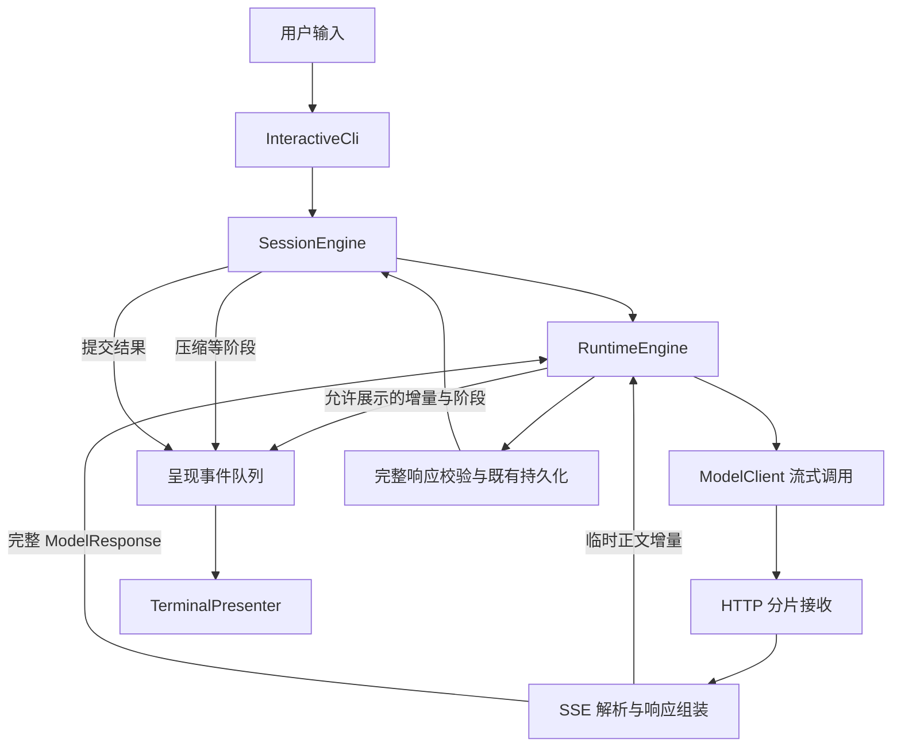

# AgentFramework 动态 CLI 与流式输出设计

日期：2026-09-14
依据：当前工作区 `AgentFramework`，提交 `00a9af4`。
状态：用户已通过“做吧”批准实施，代码已实现并完成本机验收。原方案保留作为设计依据；实际用法见 `docs/dynamic-cli.md`，验收记录见 `docs/dynamic-cli-validation.md`。

## 1. 推荐目标与用户看到的效果

建议第一期实现 **动态状态行 + 模型真实流式输出**，继续使用 C++17。第二期再增加固定输入框、历史滚动和快捷键，形成完整终端界面（TUI）。

“字符能动”暂按旋转字符、原地更新的阶段和耗时提示理解。用户若希望第一期就有完整 TUI，主要调整呈现层的工作量；下述传输和运行时设计仍然适用。

第一期的一次交互示意（示意中的耗时不是实测）：

```text
AgentFramework  |  Model: 当前模型
Workspace: E:\...\AgentFramework

you > 帮我检查这个项目的构建问题

[完成] 准备上下文  0.4s
/ 等待模型  2.1s  |  Ctrl+C 取消
```

等待期间 `/ - \ |` 轮换，同一行的时间持续更新。首段正文到达后清除动态行，进入追加输出：

```text
assistant · 生成中
我先检查项目的构建配置……

/ 正在执行工具：read_file  0.2s  |  Ctrl+C 取消
[完成] read_file  0.3s

assistant · 生成中
目前发现的主要问题是……

[完成] 本轮耗时 8.6s
you >
```

正文随网络增量到达而显示；不人为延迟逐个字符。实际块大小由服务端决定。第一期正文输出期间停止同一行转圈，避免动画与半行文本相互覆盖。后续模型或工具阶段可重新出现动态行。

## 2. 已核对的项目现状

| 现状 | 当前源码 | 对设计的影响 |
|---|---|---|
| 无参数启动交互 CLI，已有会话和斜杠命令 | `src/main.cpp:275`；`src/cli/interactive_cli.cpp` | 沿用现有入口与会话操作 |
| 进度回调只打印 Preparing context / Thinking / Running tool 三类新行 | `src/cli/interactive_cli.cpp:81` | 已有阶段信号，新增呈现器即可动态展示 |
| 完整结果返回后打印 `final_text` | `src/cli/interactive_cli.cpp:161` | 增加增量输出后，完成处理必须避免重复整篇打印 |
| `ModelClient` 只有同步 `complete(request)` | `src/ports/model_client.h:7` | 模型接口需要增加可选流事件与取消上下文 |
| HTTP 通过 `cpr::Post` 返回完整正文 | `src/adapters/anthropic/cpr_http_transport.cpp:19` | 需要接收回调，单改 CLI 无法获得实时模型内容 |
| Runtime 会持久化事件后通知 observer | `src/application/runtime_engine.cpp:117` | 保持持久化事实和临时界面通知的区别 |
| 完整响应经过 stop reason、工具结构和 RAG 约束校验 | `src/application/runtime_engine.cpp:390` | 流式显示不能提前执行工具或宣布成功 |
| Session 只将 Completed 任务提交为成功对话轮次 | `src/application/session_engine.cpp:309` | 临时文字不能直接变成下一轮上下文 |
| 终端已有 UTF-8 设置、控制字符转义、每次 8192 字节显示上限 | `src/cli/terminal_text.cpp:93`、`:111` | 增量模式需要跨块状态，不能对每块独立调用旧函数 |
| SIGINT 设置进程级取消标志，未提供按轮复位 | `src/adapters/system/signal_cancellation.cpp:10` | 必须明确取消源生命周期，保证下一轮可用 |
| 已有 Threads、CPR、JSON 库，没有终端 UI 库 | `CMakeLists.txt:4` | 第一阶段可复用现有依赖 |
| Ready 包限定 EXE、两个 DLL 和配置共四个文件 | `cmake/stage_ready_package.cmake:38` | 新增终端 DLL 会影响发布合同，第一期无需引入 |

项目当前没有模型调用自动重试循环；`retryable` 是错误属性，不能把它描述成已实现的重试机制。

## 3. 两条可选路线

| 路线 | 能得到什么 | 主要成本 | 建议 |
|---|---|---|---|
| A：现有终端上增加动态行和真实流式输出 | 转圈、阶段、耗时、工具状态、即时正文；保留终端自然滚动 | 有界 SSE 解析、呈现层、取消、兼容验证 | 第一期采用 |
| B：直接建设完整 TUI | 固定输入区域、历史区、快捷键、输出时编辑下一条输入 | A 的后端工作，加输入编辑、布局、中文宽度、缩放和终端生命周期 | 第二期采用，或用户明确需要时提升到第一期 |

第一期不新增一套 Agent Runtime。终端呈现器作为边缘模块，调用现有 Session / Runtime；后续更换呈现器不要求重写模型流协议。

## 4. 从宏观到微观的数据链路



此图省略 RAG 和工具内部实现；它们仍由既有应用层调度，向呈现层报告阶段。

### 4.1 传输与模型适配层

在 `HttpTransport` 旁增加流式入口，使用 CPR 的接收/进度回调持续读取数据，并传播取消与截止时间。CPR 版本已固定为 1.14.2，本地依赖源码可见相关回调接口；具体回调行为仍需通过传输测试验证。

增加独立的 `SseDecoder` 和 `AnthropicStreamAssembler`：前者处理网络字节到事件的边界，后者把事件组装成现有 `ModelResponse`。两者均设置缓冲上限，避免未结束的行或工具参数无限增长。

Messages API 可用 `stream: true` 返回 SSE。正文通过 `text_delta` 到达；工具输入通过 `input_json_delta` 分片到达，需要拼接；正常结束依据完整事件生命周期和 `message_stop` 判断。还须识别流内错误，不能仅凭 HTTP 200 判成功。依据：[Anthropic 流式协议](https://platform.claude.com/docs/en/build-with-claude/streaming)。

建议扩展 `ModelClient` 为可选流式调用接口，继续返回完整 `Result<ModelResponse>`，额外接收文本/生命周期回调和取消上下文。旧 `complete(request)` 保留用于现有测试替身和内部调用；不支持流的实现只在完成时返回整段，界面显示等待状态，不模拟逐字输出。

### 4.2 应用层的两类通知

保留当前持久化事件。新增临时呈现事件，携带任务 ID、模型轮次和正文块 ID，最少覆盖：阶段变化、模型开始、正文增量、正文块结束、响应接受/拒绝、本轮结束。

工具名称和工具开始/结束状态，应从 Runtime 已校验并持久化的工具事件中产生。收到模型工具参数片段时只在组装器中缓存，不能驱动执行，也不能显示为“工具已运行”。

字符增量和动画帧不写入 Runtime / Session JSONL。完整响应仍按现有逻辑持久化，成功会话仍由 `SessionTurnCommitted` 确认。恢复旧任务时不回放动画或把旧正文误认为新到达的增量。

上下文压缩、记忆整理等内部模型调用只报告阶段，不把其模型文本接入用户正文。`main.cpp` 当前直接打印的压缩/RAG 诊断需统一经过呈现层，防止与动画交错。

### 4.3 终端呈现层和线程

新增 `TerminalCapabilities`、`TerminalPresenter`、`StreamingTerminalText` 三个职责清楚的模块。

交互空闲时主线程读取输入；执行一轮时，由一个可 join 的工作线程运行同步 Session / Runtime，主线程消费事件并刷新终端。工作线程不直接写 stdout/stderr；主线程不并发修改会话状态。采用 C++17 的线程、互斥量和条件变量即可。

建议动态行每秒刷新约 10 次；正文最多合并约 30–50 ms 再刷新，首段尽快显示，不按 token 做一次整屏重绘。耗时使用单调时钟。队列有界；合并相邻正文增量，必要时背压，不静默丢弃正文或终态事件。退出、异常和取消时唤醒等待者、结束工作线程、恢复光标/颜色和终端模式。

呈现 observer 的异常沿用现有隔离原则：禁用失效的预览回调，不把界面错误解释成模型或工具失败。队列关闭时生产者停止等待；最终结果另由工作线程结果通道交回，不能因为终态通知未入队而永久等待。输出通道失效时保留运行结果/持久化错误的真实分类，并完成线程收尾。

完成结果通道采用独立的 future 或带完成标志的共享状态，必须覆盖异常退出和通知前持久化失败。主线程异常时先请求取消并关闭队列以解除背压，再 join 工作线程；不能直接等待一个正在等队列空间的生产者。

界面自身生成 VT 控制序列，模型和工具文本仍按不可信字符串净化。Windows 支持时启用 `ENABLE_VIRTUAL_TERMINAL_PROCESSING`；能力探测失败则回退纯文本。依据：[Microsoft 终端控制序列文档](https://learn.microsoft.com/en-us/windows/console/console-virtual-terminal-sequences)。

第一期状态行使用 ASCII 旋转字符和简短阶段标签，按当前终端宽度裁剪到单行。正文沿用终端自然换行；输入期间不重绘。第二期再处理固定输入区及完整的字符显示宽度模型。

## 5. 输出与失败行为的明确约定

### 5.1 普通会话与完整响应校验

普通会话允许即时展示合法的正文增量，但标记为“生成中”。在消息结束前无法知道正文之后是否还有工具调用，因此它先属于当前模型轮次的过程文字；只有最终停止原因和完整结构验证后才能判断是否为最终答复。

正常结束：不重复打印已经展示的正文；会话提交成功后显示本轮完成。没有预览的分支，例如不支持流的模型、恢复出的完成任务、本地无匹配答复，则打印最终文字一次。

断流、协议错误或取消：保留用户已经看见的文字，明确标记“未完成，本轮未提交为成功对话”。终端滚动历史中的文字不可真正撤回，不能声称事后标记等同于从未展示。

`max_tokens` 沿用当前 Runtime 行为：完整但被截断的响应可能记录为 `ModelCallSucceeded`，随后任务为 `TaskBudgetExceeded`；Session 不提交成功轮次。不能笼统承诺所有失败场景都不留任何任务日志。

### 5.2 RAG 与受整段校验约束的内容

建议启用检索证据约束时采用缓冲展示：传输仍可使用 SSE，但正文先保存在内存中，Runtime 完整检查通过后才呈现。等待时仍显示动态状态和耗时。

交互入口的实际释放点为：最终响应以 EndTurn/StopSequence 合法结束，任务 Completed，且 `SessionTurnResult` 确认会话提交成功、无错误。不能把 `ModelCallSucceeded` 当作释放信号；max_tokens、协议拒绝、断流、取消或提交失败时丢弃未展示的缓冲，只输出对应状态。

这样保留 `tool_use_forbidden` 等既有拒绝边界。它仅保证现有结构和工具约束检查先于展示，不代表项目已经具备引文语义真实性验证。`authoritative_no_match` 的本地答复按原流程展示，不虚构模型流量。

本期只展示 `text` 正文。不得把 thinking、signature 或工具参数显示成答案；不新增扩展思考功能。无法用现有领域类型正确表示并回传的内容块保持明确的“不支持”协议错误。可忽略的辅助事件与未知内容块分别处理，不能一律静默丢弃。

### 5.3 取消、超时与重试

运行中 Ctrl+C 请求取消本轮；先显示“正在取消”，确认请求/工作线程结束后再回到输入提示。为每轮建立独立取消生命周期，前一轮完全退出后才能启动下一轮，避免旧回调写入新答案。

模型 HTTP 支持传输中止，而非只在下一次模型/工具调用前检查标志。无数据到达时也必须检查取消和超时。RAG/工具继续遵守各自已有取消边界，界面不提前宣告它们已经停止。输入空闲时 Ctrl+C 退出 CLI；原有退出命令继续可用。同步非交互命令保持已有退出码约定。

取消分类必须贯穿各层：传输返回 `Cancelled`，Anthropic adapter 保留该分类；Runtime 在模型返回后、接受完整响应前检查本轮取消，写入 `TaskCancelled`。当前 adapter 会把超时之外的传输失败统一改成 `TransportFailure`，Runtime 又把模型失败写成 `ModelCallFailed`，所以这两处都要增加明确分支，避免实际取消最终显示为 Failed。总时间预算和单请求超时也分别沿用对应任务/请求错误分类。

完成与取消竞争时，以 Runtime 写入最终 `ModelCallSucceeded` 前的最后一次取消检查作为响应接受判定点；其后已进入成功提交阶段的本轮不回滚既有事件。工具轮仍在工具执行前按既有保护点再次检查取消。界面依据最终结果确认状态。

第一期保留现有不自动重试的策略。失败后给出可理解的状态，用户按现有会话/恢复流程决定下一步。若未来增加自动重试，需要独立定义尝试编号、预览分隔和重复工具防护，不能把两次请求的文字接成一篇。

### 5.4 中文、长输出和终端能力

网络块可以切断 UTF-8 字符和 SSE 行。先跨块完成协议解析，再在增量净化器中保留不完整字符尾部；只在最终结束时处理残缺编码。测试中将中文和 emoji 在每个字节位置切开。

沿用现有每条展示回答 8192 渲染字节上限，增量输出按整条模型消息累计，超限只提示一次。模型响应聚合另设独立内存上限；截断显示不改变合法完整响应的持久化语义。后续若需要提高长答案显示上限，作为独立可配置项处理。

检测到重定向、非 TTY 或 VT 不可用时，自动禁用动画和控制序列。现有 `run/resume/verify-log/evaluate-log` 的输出合同和测试保持兼容，第一期把动态/流式体验优先限定在交互入口。建议新增 `--ui auto|plain` 和 `--stream auto|off` 两个开关；这是拟议接口，当前不可使用。动画开关与模型是否流式传输互相独立。

## 6. 分阶段实施与验收

| 阶段 | 工作内容 | 本阶段应得到的可验证结果 |
|---|---|---|
| 0：基线 | 记录工作树、构建和现有测试结果，确认 CLI/日志/包输出合同 | 已有失败与本次新增问题能够分开判断 |
| 1：动态 CLI | 能力探测、呈现器、阶段事件、单写入端、异常收尾 | 用延时假模型看到持续动画；阶段不刷屏；管道无控制码 |
| 2：真实流式链路 | HTTP 接收回调、SSE 解码、响应组装、模型流接口 | 延迟 loopback 服务的首段正文在响应结束前到达 CLI |
| 3：Runtime/Session 接入 | 正文预览、RAG 缓冲、工具多轮、完成去重、取消生命周期 | 完整校验和持久化合同保留；取消后下一轮正常 |
| 4：回归与发布验证 | 新增故障测试、现有测试、Windows 实际终端视觉检查、Release 包验证 | 本地可运行 EXE；报告源码测试、真实服务和包验证各自覆盖范围 |

阶段 1 单独完成只代表动画可用；第一期交付必须包括阶段 2–4，才能称为“动态 CLI + 真流式输出”。

优先修改现有文件：

- `src/ports/model_client.h`：流式调用扩展与非流式兼容。
- `src/adapters/anthropic/http_transport.h`、`cpr_http_transport.*`、`anthropic_messages_client.*`：传输、组装和适配。
- `src/application/runtime_engine.*`、`session_engine.*`：呈现事件传播、预览策略与完成时序。
- `src/cli/interactive_cli.*`、`terminal_text.*`、`cli_app.*`、`src/main.cpp`：终端呈现、开关和装配。
- `src/adapters/system/signal_cancellation.*` 及相关取消上下文：按轮生命周期。
- `CMakeLists.txt`：登记新增源文件和测试。

建议新增文件（名称可在实现时按项目约定微调）：

- `src/domain/model_stream_event.h`
- `src/adapters/anthropic/sse_decoder.*`
- `src/adapters/anthropic/anthropic_stream_assembler.*`
- `src/cli/terminal_capabilities.*`
- `src/cli/terminal_presenter.*`
- `src/cli/streaming_terminal_text.*`

## 7. 必须覆盖的测试场景

1. **确实边接收边显示**：loopback 服务发首个正文事件后暂停；在服务端发送结束事件前确认客户端已观测正文。仅给完整字符串做拆分回调的假模型不能证明 HTTP 真流式。
2. **协议分片**：一字节切分、多事件同块、LF/CRLF、空行、多行 data、ping、辅助未知事件、无结束事件、乱序/重复块索引、超大行/参数、JSON 损坏。
3. **工具闭环**：正文后工具调用、多个工具块、分片参数；完整响应校验前工具执行计数必须为零，最终工具调用只发生一次。
4. **错误和约束**：HTTP 错误、HTTP 200 内的错误事件、无数据超时、max_tokens、非法 stop reason、RAG 禁止工具分支；检查失败状态和既有日志语义。
5. **取消与生命周期**：收到首段前取消、正文中取消、等待网络时取消；线程/请求结束，界面收尾；立即开始第二轮可正常完成。
6. **终端安全与兼容**：中文/emoji 跨块、跨块 ESC/控制码、长回答累计限额、重定向、plain 模式、窄窗口和窗口缩放；输出结束不重复正文。
7. **恢复与持久化失败**：旧 JSONL 可重放；临时增量不成为会话上下文；最终持久化失败不能显示“已完成”；恢复任务不把历史文字重复流出。
8. **内部模型隔离**：上下文压缩和记忆整理的模型文本不会出现在用户答复中。
9. **通知和队列故障**：observer 抛异常、队列满时取消、呈现器异常、通知前持久化失败，都能通过独立完成通道结束等待；没有线程永久阻塞或虚假的完成状态。

复用 `tests/adapters/anthropic_messages_client_test.cpp` 已有的本地 sockets 测试设施，并扩展 Runtime / Session / InteractiveCli 测试。视觉验收使用实际 Windows Terminal/PowerShell；管道测试通过不能替代动画、换行和光标恢复检查。

实施时先记录当前测试基线，不引用历史通过数量。实际配置的 Anthropic 兼容端点另行进行固定短句验证，过程和结论记录在验收报告中。

## 8. 第二期完整 TUI

在第一期链路稳定后，增加固定输入区、输入历史、多行粘贴、斜杠命令补全、可滚动对话区、工具详情折叠，以及 Markdown/代码块展示。

这一期需单独选择终端布局/输入组件并核对当前 Windows 中文支持、维护状态及静态/动态链接方式。复用第一期模型流事件和呈现状态，不让 TUI 组件直接操作模型协议、事件日志或工具执行。

## 9. 本方案的验收结论形式

实施完成后的报告应分别说明：动态界面实际看到的效果、HTTP 首段到达证据、功能与故障测试结果、真实端点验证结果、Release 包检查结果。只有实际执行过的项目才标记为通过。

当前推荐交付边界：**Windows 交互 CLI 的动态阶段/耗时/工具状态、普通会话真流式正文、RAG 校验后展示、按轮取消、纯文本降级及原有日志恢复兼容。**
